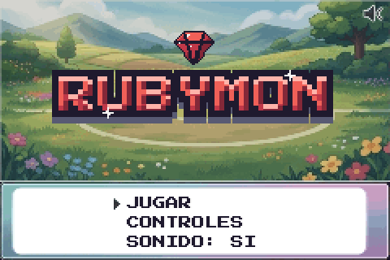
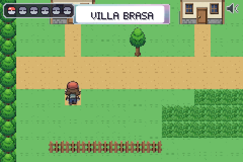
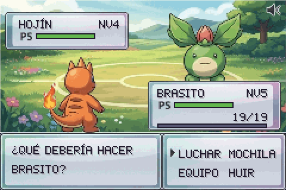
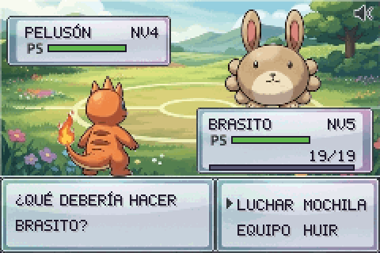
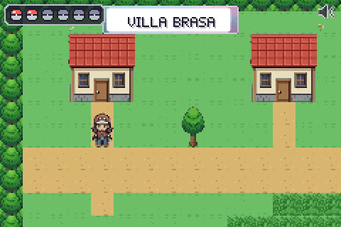

# Rubymon

Juego de rol por turnos inspirado en los clásicos de la Game Boy Advance, hecho con **Phaser 3 + Vite + TypeScript**. Exploras un pueblo, entras a una casa, te cruzas con criaturas en la hierba alta, combates con animaciones propias para cada movimiento y las capturas con Poké Balls para formar tu equipo.

<p align="center">
  
</p>

## Cómo se ve

<table>
  <tr>
    <td align="center"><br><b>Explorar y descansar</b><br>Villa Brasa, la casa con cama y cofre</td>
    <td align="center"><br><b>Combate</b><br>Una animación propia por movimiento</td>
  </tr>
  <tr>
    <td align="center"><br><b>Captura</b><br>La ball vuela, se sacude y atrapa</td>
    <td align="center"><br><b>Pausa y mochila</b><br>Equipo de hasta 6 y elección de líder</td>
  </tr>
</table>

## Qué incluye

- **Flujo completo:** título (JUGAR · CONTROLES · SONIDO) → mundo ⇄ combate; pausa con Esc/P (CONTINUAR · MOCHILA · SONIDO · SALIR AL INICIO, con confirmación).
- **Mundo:** *Villa Brasa* y *Ruta 1* unidas por un camino, colisiones, agua animada, hierba alta que cubre los pies y cartel con el nombre del mapa. La casa de la izquierda se puede visitar: la **cama** cura a todo el equipo y el **cofre** repone las Poké Balls.
- **Combate por turnos:** orden por velocidad, daño con STAB y tabla de tipos (Fuego, Agua, Planta, Normal), PP, experiencia y subida de nivel, huida probabilística.
- **Animaciones por movimiento:** embestidas, zarpazos, colmillos, bolas de fuego, chorros de llama y agua, ondas, lianas y remolino de hojas, con retroceso con destello y sacudida de cámara según la eficacia.
- **Captura:** MOCHILA → POKÉ BALL. La probabilidad sube cuando el rival tiene pocos PS y depende de cada especie; la ball se sacude hasta 3 veces. Las capturadas pasan al equipo (máx. 6, contador de pokéballs arriba a la izquierda) y puedes elegir al líder desde la mochila.
- **Audio 100 % procedural** (Web Audio): efectos y tres canciones chiptune (título, mundo y combate).
- **Logo y HUD generados por código:** el logo *RUBYMON* se rasteriza y se pinta píxel a píxel con bisel de gema; las pokéballs del HUD y las partículas son pixel art en matrices.

## Cómo ejecutarlo

```bash
npm install
npm run dev          # http://localhost:5173
```

| Acción | Teclas |
| --- | --- |
| Mover | Flechas o WASD (una dirección distinta solo gira; mantener camina) |
| Confirmar / interactuar | Z, Enter o Espacio |
| Volver | X, Backspace o Esc |
| Pausa | Esc o P |
| Silenciar | M o clic en el altavoz |

El navegador solo permite audio tras un gesto: la música empieza con la primera tecla que pulses.

## Comandos

| Comando | Qué hace |
| --- | --- |
| `npm run dev` / `npm run build` | Servidor de desarrollo / comprobación de tipos + build en `dist/` (rutas relativas) |
| `npm test` | 70 tests (motor de combate y captura, canciones, atlas, mapas, animaciones) |
| `npm run lint` · `npm run check` | ESLint · lint + tests + build (lo que ejecuta el CI) |
| `npm run maps` | Regenera **solo** los mapas de Tiled desde `tools/maps/` |
| `npm run assets:import` | Reconstruye el atlas desde `assets-src/custom/atlas.jpg` |
| `npm run assets:import-tileset` | Reconstruye el tileset desde `assets-src/custom/tileset2.jpg` |
| `npm run gifs [-- nombre…]` | Graba los GIF de este README jugando el juego real (con `npm run dev` en marcha) |
| `npm run shot -- <nombre>` | Captura del juego real con Chromium headless (ver `tools/screenshot.ts`) |
| `npm run assets` | ⚠️ Regenera atlas, tileset, fuente y mapas con el arte **procedural** de `art/`: sobrescribe el atlas y el tileset importados. Para tocar solo los mapas usa `npm run maps` |
| `npm run assets:kenney` | Variante con packs CC0 de Kenney (`npm run assets:download` antes) |

> La primera vez, para `npm run shot` / `npm run gifs`: `npx playwright install chromium`.

## Cambiar el arte

El juego no genera nada en runtime: carga archivos de `public/assets/`. Hay dos formas de cambiar personajes y tiles (contrato completo en [`docs/ASSETS.md`](docs/ASSETS.md)):

1. **Editar el atlas a mano.** Abre `public/assets/atlas.png` en LibreSprite o Aseprite; las posiciones de cada frame (`brasito_front`, `player_down_0`…) están en `atlas.json`.
2. **Importar desde una imagen.** `tools/import-atlas.ts` y `tools/import-tileset.ts` recortan, quitan el fondo (blanco o magenta) y escalan cada sprite a su tamaño de juego. El orden de los sprites en la imagen está documentado en el propio script.

## Arquitectura

```
art/                      Arte procedural (se usa en build: interiores, partículas, HUD, gema del logo)
assets-src/custom/        Imágenes fuente del atlas y del tileset
tools/                    Importadores, mapas ASCII → Tiled, capturas y GIF (no entran en el bundle)
public/assets/            Lo único que carga el juego: atlas, tileset, fuente bitmap y mapas de Tiled
src/
  main.ts config.ts       Arranque de Phaser y constantes
  data/                   Datos puros: especies, movimientos, tipos, encuentros, ids de mapa
  systems/                Reglas sin Phaser: battleEngine, creature, gameState, audio, songs, moveFx, pool
  scenes/                 Preload, Title, Overworld, Battle, Pause, Party, UI
  ui/                     PixelText, StatusBox, menús, logo, texturas de HUD
```

```
PreloadScene → TitleScene → OverworldScene ⇄ BattleScene (sleep/wake)
                                 │  ├─ PauseScene → PartyScene
                                 │  └─ interacciones y diálogos (cama, cofre)
                                 └── UIScene (HUD de equipo y silencio, siempre encima)
```

### Decisiones de diseño

- **Combate = eventos.** `Battle.resolveTurn()` es lógica pura que devuelve una lista (`text`, `move`, `hit`, `catch`, `faint`, `exp`, `levelUp`, `end`); `BattleScene` solo la reproduce con `async/await`. Por eso el motor y la captura se testean sin render.
- **Mapas como datos de Tiled.** Colisiones, hierba alta, agua animada, warps e interacciones salen de capas y propiedades del JSON, no de constantes en el código. Los mapas fuente son ASCII (`tools/maps/`) y se convierten con `npm run maps`.
- **Escena de combate persistente** (`sleep`/`wake`) con *object pooling* (`src/systems/pool.ts`) para impactos, textos y cortinas: los objetos creados no crecen tras el primer combate.
- **Pixel-perfect:** 240×160 internos, `pixelArt`, `roundPixels` y zoom entero máximo que quepa en la ventana.
- **Fuentes:** el texto de combate usa una fuente bitmap propia (compacta, solo mayúsculas); el título y los menús usan *Press Start 2P* (OFL, vía `@fontsource`).

## Pruebas

`npm test` ejecuta 70 pruebas: motor de combate (tipos, daño, orden, PP, EXP, huida, **captura**), canciones, integridad del atlas y de los mapas de Tiled (incluidas las casillas de warp), y que cada movimiento tenga animación.

## Límites conocidos

- Cada criatura tiene 4 movimientos fijos; no hay estados alterados, tienda, PC ni guardado de partida.
- Solo empiezas con una criatura y el equipo crece capturando; si está lleno (6), la criatura capturada se va.
- Los tiles de interior son pixel art generado por código y se ven más "duros" que el exterior.
- La música está verificada por medición de nivel, no por escucha.

## Créditos y licencias

- **Atlas de sprites y hoja de tiles:** ilustraciones propias procesadas con los scripts de `tools/`. Revisa el parecido con franquicias existentes antes de distribuir el juego.
- **Generado por código:** interiores, partículas, HUD, logo, música y efectos de sonido.
- **Fuente:** *Press Start 2P* de CodeMan38, [SIL OFL 1.1](https://openfontlicense.org). Ver [`CREDITS.md`](CREDITS.md).
- **Opcional:** packs CC0 de [Kenney](https://kenney.nl) (`assets:kenney`).
- Dependencia de ejecución: `phaser` (MIT).
